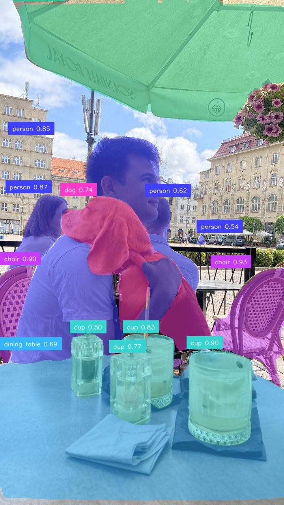
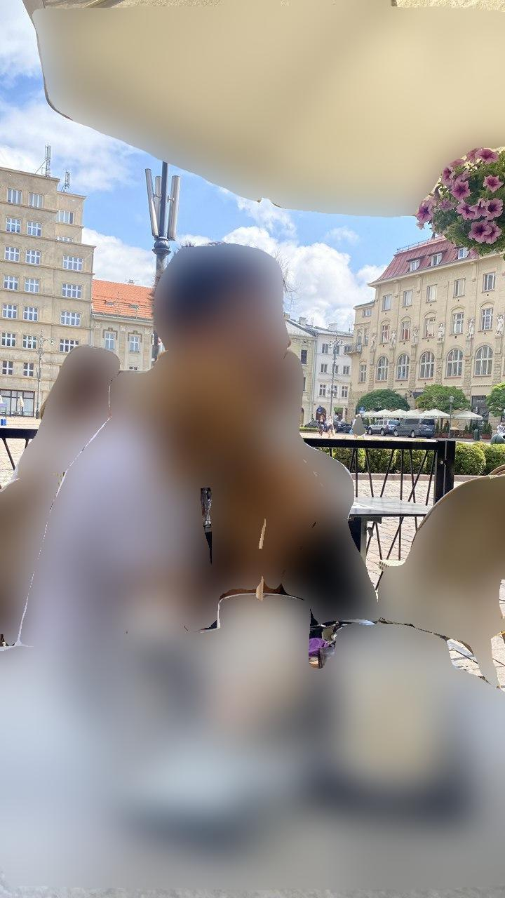

# scope-rf-detr-segmentation

Real-time **instance segmentation** plugin for [Daydream Scope](https://github.com/daydreamlive/scope),
powered by Roboflow's [RF-DETR](https://github.com/roboflow/rf-detr). It runs RF-DETR's
segmentation models per frame and either overlays the per-object masks or **blurs the
segmented regions for privacy**.

> Companion to [scope-rf-detr-detection](https://github.com/gioelecerati/scope-rf-detr-detection)
> (bounding-box detection).

## Modes

| Mode | Output |
|---|---|
| `masks` (default) | Colored per-object segmentation masks + class labels |
| `privacy_blur` | Gaussian-blurs only the segmented regions, rest of the frame stays sharp |

`masks`:



`privacy_blur` — blur the people/objects, keep the scene:



## Features

- Scope pipeline node: **`rfdetr-segmentation`**
- RF-DETR segmentation variants: `preview`, `nano`, `small`, `medium`, `large` (Apache-2.0)
- Per-object instance masks for the 80 COCO classes (via [`supervision`](https://github.com/roboflow/supervision))
- Built-in **privacy blur** that masks-and-blurs in a single node — no separate compositing node needed
- Real-time on a consumer GPU

## Why privacy blur is in-plugin

A generic blur node blurs the *whole* frame — it has no notion of *which* pixels are the
mask. Scope doesn't carry an alpha-mask between nodes, so selective blur has to combine the
mask and the frame in one place. This plugin does exactly that: it blurs only the segmented
pixels and outputs a normal `video` stream you can still route anywhere in a Scope graph.

## Compatibility

RF-DETR is pinned to **`rfdetr==1.5.0`** — the newest release that requires `transformers<5`,
matching Scope's pinned `transformers 4.57.x`. `rfdetr>=1.6` requires `transformers>=5.1`,
which conflicts with Scope's diffusion stack.

## Installation

```bash
uv add --editable ../scope-rf-detr-segmentation
# or
uv pip install -e ../scope-rf-detr-segmentation
```

Segmentation weights download automatically on first use.

## Configuration

| Parameter | Default | Description |
|---|---|---|
| `model_variant` | `nano` | `preview` / `nano` / `small` / `medium` / `large` |
| `confidence_threshold` | `0.5` | Minimum detection confidence |
| `render_mode` | `masks` | `masks` overlay or `privacy_blur` |
| `mask_opacity` | `0.5` | Mask overlay opacity (`masks` mode) |
| `show_labels` | `true` | Draw class labels (`masks` mode) |
| `blur_strength` | `25` | Gaussian blur radius (`privacy_blur` mode) |

## Local test

```bash
python manual_test.py   # saves rfdetr_seg_masks.jpg and rfdetr_seg_privacy_blur.jpg
```

## License

Plugin code: Apache-2.0. RF-DETR (`preview`–`large`) and `supervision` are Apache-2.0.
